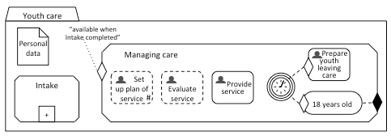
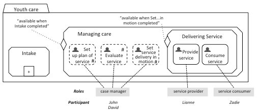
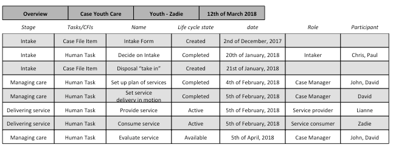

In earlier blogs we argued that a case engine decides on what should, could or must be done as a next step in handling the case. This decision results in availability of Plan Items. We showed that the case engine was triggered by life cycle events of Plan Items and Case File Items and used Sentries placed on Plan Items when evaluating their availability. We also showed that CMMN allows for Plan Items that can be planned at the discretion of the case worker. Because of that the case worker can perform the task of the case engine by making these discretionary Plan Items available himself. Also, in CMMN you can model repeatability of human tasks and other Plan Items, meaning a task that is completed can be made available a second, third or fourth time – whenever its sentry “is satisfied”. So, there are various ways to influence availability of tasks.

**If 18 years old then Stop!**
An appealing aspect of CMMN is that a value inside the CFI can also be evaluated by the case engine. In our example case, Youth care, we manage the care of a youth, but we are to stop this care when the youth turns 18. In CMMN it is possible to model a Timer Event that triggers the evaluation of age, nested in the sentry, so in our case the age of the youth in care. Doing this, “the system” helps you keep track of the youth’s age: you won’t need to check it yourself.

The modelled TimerEventListener fires every month. It triggers the Human Task Prepare leaving care when the youth is 17 years and 8 months old and the Milestone “18 years old” when that age has been reached. The completion of this milestone will set the life cycle state of the Stage Managing care to completed. 

Let’s assume that dateOfBirth is an attribute of the Case File Item Personal data that is available in the Case File associated with the case Youth Care. We can then add code to both Sentries. The code of the Sentry placed on the Milestone 18 years old will look like (if age(cfiPersonaldata. dateOfBirth, actualDate) >= 18 then setLifeCycleEvent(caseName (‘Youthcare”), stageName(“ManagingCare”), completed). This is how to evaluate values inside a Case File Item.
Note that we introduced two more modelling elements: EventListeners and Milestones. To capture events, CMMN uses the concept of the EventListener, which is specialized into TimerEventListener and UserEventListener. A TimerEventListener catches predefined elapses of time. A UserEventListener catches events that are raised by a User. The abstraction EventListener enables the case engine to handle any event in a uniform way, namely as “standard events” that denote transitions in life cycles of Plan Items and Case File Items. A Milestone, a Plan Item, represents an achievable target defined to enable evaluation of progress of the case. 

**Of course there are Roles in CMMN**
Like many other modelling languages, CMMN uses the concept of a Role to which Human Tasks and also Process and Case Tasks can be assigned. A Role may be assigned to one or more participants that are allowed to perform the task. However, assignment of Roles to participants is not included in the scope of CMMN.

The Role itself is an attribute of a Task and has itself no depiction in CMMN. In the model below we listed three roles: a case manager, a service provider and a service consumer. We assigned participants to these Roles, because we’d like to provide you with an overview of the case –what has been done, is being done and can be done next.

As we have suggested in a previous blog, a case manager can set up – in managing care– a plan of services and evaluate these services. In this model we made only a slight adjustment. We've added a human task Set service delivery in motion, meaning that a case manager can actually ask a therapist and a youth to start a therapy together and give feedback on the delivered service. The Role service consumer will always be Zadie in this case. 

The case manager’s intention is to assign real persons to the task Provide service. Earlier on he has set up a plan of services and verified which therapists can provide it; he also made certain that the therapists listed were very well known. In assigning real people, a generic Role service provider is of little help. The case manager needs to assign a specific participant to the generic role Service provider. Let’s call her Lianne. 

We modelled a sub stage Delivering Service, in which two tasks are made available. The task comprises the invitation to provide and consume the service, and for both the provider and the consumer to give feedback on the service.

**Build your own case overview**
What should, could or must be done can be communicated in a Case overview. Providing a case overview will give all participants insight into what has been done, what is going on and what the next steps may be. This overview is not a CMMN element, you have to build it yourself.

So, the overview depicted below is dated 12th of March 2018, is about the Case youth care, and the youth taken in care is Zadie. What is being done are the tasks labeled with the life cycle state “Active”, being Provide service and Consume service, meaning that both Lianne and Zadie have accepted the task –both on 5th of February, 2018– and they are now performing it. 

These two tasks were enabled by David completing the task Set service delivery in motion, and that task was preceded with the completion of Set up plan of services. Before that, the stage Intake –in casu the task Decide on intake– was performed, and an Intake form and a Disposal where both created. The Intake form was created (received) on the 2nd of December 2017, the Disposal the 21st of January.

We are now awaiting the task Evaluate service to be performed by one of the two case managers, John or David. We did not model a Sentry on this Human Task. We presume John and David will act upon the feedback that Lianne and Zadie will send in. For John and David the availability of the Evaluate-task will be a reminder to request feedback if it is not received before the 5th of April.

[Frans van Besouw](mailto:frans.vanbesouw@spronq.com), Business Consultant at SpronQ
