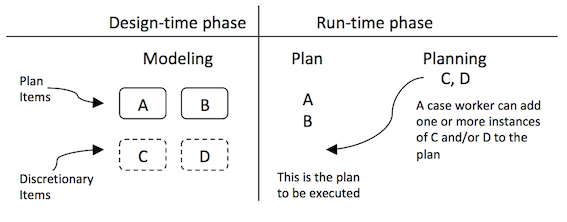

In a [previous blog](/blog?post=cafienne-blog-frans-2), we discussed how to model a case and how the Qollabor case engine interprets that model. The discussion was rather high-level and did touch only some of the modelling elements and interpreting mechanisms. So, let’s elaborate on the model and the engine a little further...

**Modeling information**
I think an alluring aspect of CMMN is that we can model “information”, next to Plan Items. Associated to every case is a Case File that contains one or more Case File Items. Case File Items are used to represent all kinds of information, including a data value in a database, a row in a database, a document, a spreadsheet, etc. So, the case file holds all information that is related to the case. 

The case engines interprets life cycle events of Case File Item, next to the interpreting of Plan Item life cycle events. When a Case File Item is associated with a Human Task, the availability or the completeness of that task can be evaluated: when a Case File Item is created, an associated task will be made available. We can associate a Case File Item with a Human Task using a Sentry. This Sentry allows us to describe whether a Task or Stage should be available (entry criterion) or can be completed (exit criterion).

**Sentries depicted with diamonds**
In our youth care case we introduce an Intake Form as a case file item. When the Intake Form is created, the associated Sentry on the task Decide on Intake will be interpreted by the case engine and accordingly this task will be made available. A Sentry used as entry criterion is depicted with a white diamond shape. Note that we omitted the task or event in which the Intake Form is created. 

Let’s assume that the task Decide on intake is concluded with a formal disposal to take in. This disposal is modelled above as case file item that is associated to an exit criterion (black diamond) on the stage Intake. The case engine will now prohibit that the life cycle of the stage Intake is set to is set to “complete” if no disposal is available. The stage Intake can only be completed if the disposal is available.

**Another alluring aspect**
Another alluring aspect is that a case worker can act as case engine. How is that possible? Well, by modelling a task or stage as a discretionary item. A discretionary item is available to the case worker, to be applied in addition to his/her discretion. In this, it is opposed to planned items. Those are not applied to the discretion of the case worker, but to the discretion of the designed system.

In the previous blog, we argued that the execution of our CMMN-model by the engine would give an overview of all that can be done. So, we can argue now that a case worker can act as a case engine adding tasks run-time that are modeled in the design-time as discretionary items to this lists of “things to be done”.

Let’s return to our example case and model discretionary items (in design-time) a case worker can add to “things to be done”. In the model below, some discretionary items are added.

**Set up plan, provide, evaluate**
The Stage Intake is in this model collapsed for convenience reasons. By adding the sentry to the stage Managing care, we assure that this stage is only available when the Intake stage is completed. Note that a Sentry can both evaluate the life cycle of Case File Items and Plan Items.

In our previous blog we argued that youth care compromises the providing of services. Because of this, we modelled a human task Provide service. But how does the youth worker know what services to provide? By adding the discretionary tasks Set up services plan and Evaluate service, it is possible for the youth worker to plan the services and to evaluate services he provides for. 

Setting up the plan means the youth worker will plan several services in sequence. Providing a service means sending an instruction to both the service supplier and the youth to start the service, including the invoicing and feedback on the result. Once feedback is received, the youth worker can plan the task Evaluate service and, dependent on the evaluation, change the plan –by planning the task Set up plan of services– and/or provide a next service.

**Maybe a bit cumbersome**
Note that we added to this task the symbol “#” to the task Provide service. In CMMN this means that the task is repeatable, that it can be executed more than once. This means, any time the youth worker opens the case in the stage Managing care, this task is available. So, providing services is not dependent on the two discretionary tasks. However, any time the youth worker sees reason to, he can plan the set up and evaluation-tasks.

It all may look a bit cumbersome, and maybe the model is not really appropriate at this moment. For excuse, our purpose was to show some alluring aspects of CMMN. We hope we succeeded and are aware of the fact that we compromise between introducing CMMN and designing a really appropriate model. 

In a next blog we will introduce other cool elements of CMMN... 

[Frans van Besouw](mailto:frans.vanbesouw@spronq.com), Business Consultant at SpronQ
