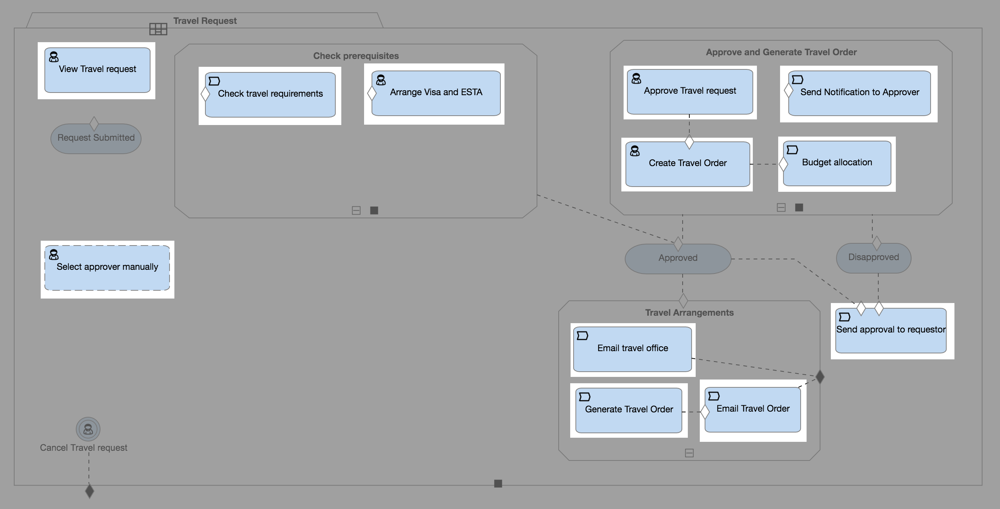

One of the great benefits of using Qollabor is that we can create a graphical model that allows us to visualize our workflows. In our [previous post](cafienne-intro), we introduced how we use Qollabor to improve the organization of our work. In this post, I want to go a little more in-depth and show how we make this happen.

As you might have experienced in your own workplace, organizing work can become pretty complex. We may have a clear end goal in mind, but the path can be tedious to navigate  through ad-hoc decision making and other business events. With Qollabor, we can create a reusable model that clearly defines  how we can achieve a goal and organize the work.

This concept of modeling cases is called the [Case Management Model and Notation (CMMN)](http://www.omg.org/spec/CMMN/1.1/) which is a standard that is maintained by the Object Management Group and is the premise for Qollabor.

In order to dive deeper into CMMN, we’ll first need to understand some of the common symbols and terminology they use. In our previous post, we showed the case model (below) for a travel request. However, this example is a bit oversimplified in that it makes the case plan look like a linear flow from task to task.

When, in reality, the following case model is a more realistic example of what this case model would look like:

As you can see, there is not a clear flow from one task onto the next. To get a better understanding of how to read these models, let’s dive into some terminology to learn about the basic building blocks that make up a case model.

The model itself is called a **Case Plan Model**. In Qollabor, this is represented by a folder with a descriptive name in the top tab:

The various activities of a case plan model are depicted within this document shape.
The basic unit of work is a **Task**:

There are three types of tasks: Human, Process, Case.

A **Human task** requires a user to perform an action. Users performing human tasks are referred to as **Case Workers**. For instance, the requestor and approver are case workers in our travel request example. Furthermore, a Human task can be **Blocking** or **Non-Blocking**. If a task is blocking, it simply means that the task must be completed before the case plan can continue. If a task is non-blocking, it is assumed that the task will be completed and that completion does not need to be tracked within Qollabor for the case plan to continue. An example would be sending a package with a courier. We do not need confirmation that the package was sent and delivered for the case plan to continue.

Example of a Blocking Human Task:  

Example of a Non-Blocking Human Task:  

A **Process Task** will execute a business process modeled in another modelling language or it could call an external service which triggers external actions like emailing the travel office with details about the travel request.

A **Case Task** will execute  another case. This case can run standalone or as a child of the current case. This provides a way of breaking down  complex case models into smaller, more manageable pieces.

[Next week](cafienne-blog-3), we’ll continue with a bit more terminology that shows how we can group these activities and build robust case processes. I hope you enjoy reading this first small step into the world of Case Modeling with our tool.

[Han van Oostende](https://www.linkedin.com/in/hvoostende), DevOps Engineer at SpronQ
