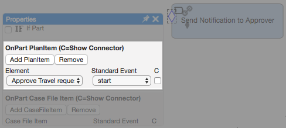

In last week’s [post](cafienne-blog-2), we introduced some of the common symbols and terminology used in CMMN modeling. We found that the basic unit of work that make up a case model is called a **Task**. As shown below, many tasks may exist within a case model plan.

With no visible arrows or lines connecting one task to another, how exactly do we go from one task to the next and end up actually completing a case? We can use criteria called **Sentries**. These diamond-shaped icons set certain conditions and dependencies on a task.

For example, all the sentries in our travel request case model example are highlighted below. As you can see, a sentry can be placed on a task or group of tasks. A task can even have more than one sentry.

If a task has entry criteria that must be met before it is triggered, the sentry icon is white.

And if the task has exit criteria, the sentry icon is solid black.  

A sentry is triggered if an event happens and/or if a certain condition is met. In the settings window of a sentry, we can specify when a sentry should be triggered. A sentry can be triggered either **ON** an event or **IF** an event occurs. We can set this criteria in the sentry settings menu in Qollabor.

If we want to have a sentry triggered **ON** an event, we specify this in the **OnPart** section of the sentry settings:  

If we want to have a sentry triggered IF a certain condition is met, we specify this in the **IfPart** section of the sentry settings:  

Let’s take a look at some of the sentries in our original travel request case example.

We have a process task called “Send Notification to Approver” (located in the top right) that has a sentry attached with entry criteria. If we click and open the settings for this sentry, we can see that it has event criteria specified in the **OnPart**.

These settings indicate that the “Send Notification to Approver” task will be executed **ON** the start of “Approve Travel Request” task.

If we look again at our example case, we have a human task called “Create Travel Order” (located in the top right) with sentry attached with entry criteria.

When we look at the settings for this sentry, we can see that it has event criteria specified in the **If Part**. This indicates that **IF** the “Approval” has the status “approved”, then the “Create Travel Order” task will be triggered.

[Next week](cafienne-blog-4), we’ll continue to build our knowledge of CMMN terminology by exploring **Milestones** and **Event Listeners** and how they help us build complex, but robust, case models in Qollabor.


[Han van Oostende](https://www.linkedin.com/in/hvoostende), DevOps Engineer at SpronQ
