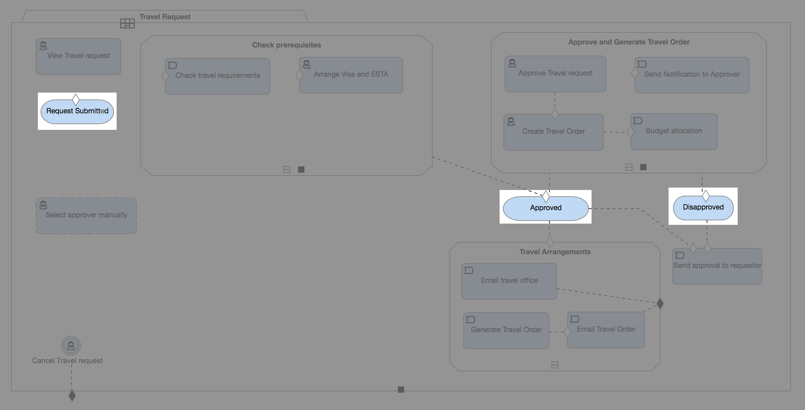
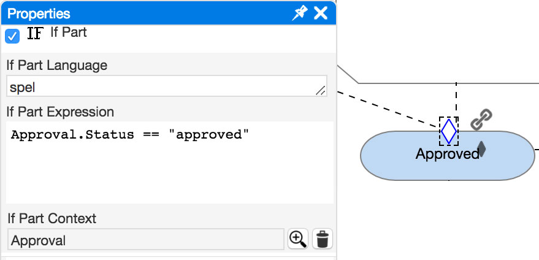
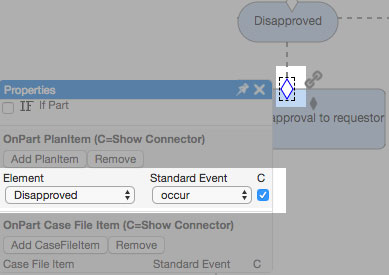
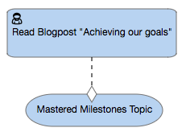

In our previous [post](cafienne-blog-3), we looked at sentries and how they can be used to trigger other events to occur.
Sentries can be attached to tasks, but there are other plan items, such as **Milestones**, where sentries are useful. As shown below, a **milestone** is represented by a rectangle shape with rounded ends.  

A **Milestone** represents an achievable target. They can be used to show that a certain goal has been reached in the case.

The conditions that must be met to achieve a milestone can be clearly defined by attaching a sentry to it. In the example below, we see the “Approved” milestone with an attached sentry. In the properties window, we can see that this milestone is reached if the approval status is equal to “approved”.  

A **Milestone** can also be used as an entry criteria for other plan items.
In the example below, the “Send approval to requestor” task is triggered when the “Disapproved” milestone occurs:

Milestones are beneficial plan items in a case, because they allow us to assess a case’s progress. They are not associated with work like a task is, but rather indicate certain conditions have been reached within a case.

As demonstrated in the case model below, by reading this article, you have completed your very own milestone, “Mastered Milestone Topic”. Congratulations!

[Next week](cafienne-blog-5), we’ll explore the concepts of Stages and Event Listeners as we continue to build a deeper understanding of CMMN.

[Han van Oostende](https://www.linkedin.com/in/hvoostende), DevOps Engineer at SpronQ
