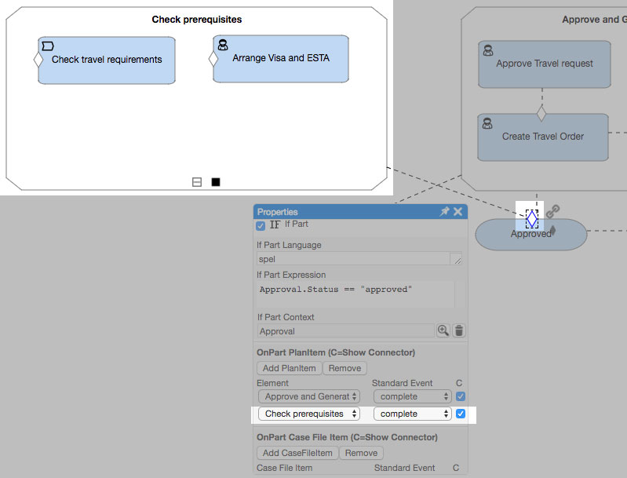
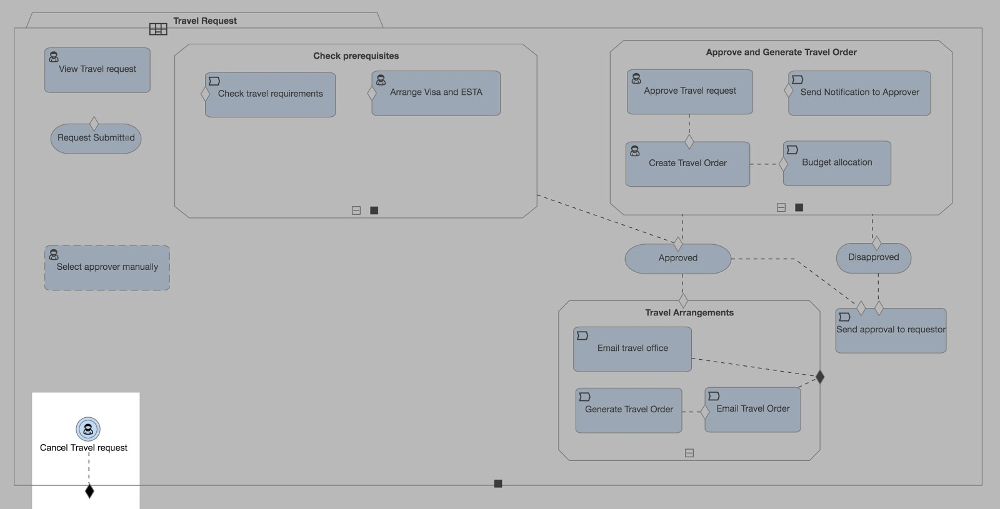

[Previously](cafienne-blog-4), we took a look at how we can use Milestones to indicate achievable goals in a case. You may have noticed in those examples that some milestones were connected to a group of tasks.

When creating our case models, sometimes we have plan items that are closely related and need to be grouped together. These items could be multiple tasks that must be completed before the case can proceed.  We can bundle these items into a **Stage**. A **Stage** is represented by a rectangle with angled corners and either a  or  symbol.

For example, in our travel request case model, we have some tasks that have to be completed before the milestone “Approved” can be achieved. We can group these two plan items, “Check travel requirements” and “Arrange Visa and ESTA”, into a stage called “Check Prerequisites” that is checked before the milestone is reached.

We’ve explored how we can set up all kinds of conditions and events that can trigger other plan items, but what if a event doesn’t relate to a specific task in our case?

For instance, what if the person who initiated a travel request suddenly needs to cancel the business trip and clicks the cancel button to stop the request? This event is not necessarily tied to a specific plan item in the case model, but, nonetheless, this “cancel” event needs to be recorded and whole case needs to be closed.

For these type of events, we can set up **Event Listeners**. **Event Listeners** are represented by a double-lined circle as shown above. They are used to model events that do not happen specifically to plan items.

Over the past few weeks, we’ve looked at several CMMN modeling concepts in-depth in order to gain some context to better understand Cafienne. Next week, we are looking forward to getting some hands-on experience with Qollabor itself!