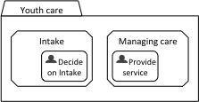
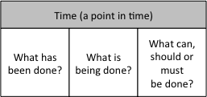

This blog addresses the issue of modelling an IT-system that is capable of supporting a youth care organization; from now on we will call this organization YouthCare. In a [previous blog](cafienne-blog-frans-1) you can find what such a system should be capable of. In this blog we will start modelling the system.

**Evolving circumstances**  
We would like to propose the use of Case Management Model and Notation (CMMN) for modelling. CMMN is well suited to model the workflow around the youth worker because CMMN models activities that depend on evolving circumstances and ad hoc decisions by knowledge workers regarding a particular situation. In this respect, it differs from BPMN that models predefined sequences of activities and decisions. 

The model helps us as designers to start a dialogue with YouthCare about their needs and wishes and it gives an idea of what the system should do and what components should be built. All in all, we can gain a deeper understanding of the system by modelling it.  

**Providing services**  
Where do we start with the CMMN-model? It is a good practice to start designing the model at the beginning, at the moment a youth enters the care process. There could be a variety of reasons for a youth to enter a program of YouthCare. In this blog we avoid pointing out specific reasons and circumstances for this but let’s assume parents may see a reason to contact YouthCare for support. At such a request YouthCare will start an intake procedure. At the end of the intake, YouthCare will decide whether it can help the youth.

The care that YouthCare provides consists of several types of services: general social work, parenting support, youth mental health care, and child protection. So, when taken in, YouthCare will start a program of services. 

**Our first step in modelling**  
In CMMN we can now model a Case “Youth care” that comprises two primary Stages: “Intake” and “Managing care”. The first contains the Task “Decide on intake”, the second the Task “Provide service”. In CMMN, a Task is to be considered as an atomic unit of work. A Stage can be understood as a grouping of Tasks and also as a “phase” that has to be “closed” before you can start Tasks belonging to another Stage. 

**How does such a model help?**  
A  Case engine  interprets the CMMN-model. The engine keeps track of what has been done in a Case, what is being done and suggests what can, should or must be done next. According to CMMN these “whats” make up everything that can be planned in the context of a Case. The category of what can be planned contains first of all Stages and Tasks. 

All these “whats” can be shown in a user interface that we call “my actual Cases”. What has been done or is being done is also relevant in “my actual Tasks” and can be shown in every user interface dedicated to a specific Task. 

So, if  YouthCare is providing services, the execution of our CMMN-model by the engine will give an overview of all what has been done and all that can be done.

**Some technical stuff**  
Central to the case engine’s interpretation is the life cycle of the case itself and the life cycle of each plan item it contains. The life cycle start with the state “available”. Once the case or a task is available, a case worker can activate it. When the task is active, a case worker can start working on it. Working on the case can lead to different statuses such as completed, terminated, or suspended. When suspended, the case can be re-started. When completed or terminated, the case can be closed. 

But what tasks are available in our model? First of all, if YouthCare starts a case, only the Stage Intake is available. Inside this stage, there is only one human task to execute. When completed, the engine will set the status of the stage Managing Care to “active”.

**In plain English**  
In plain English, the case engine would for instance know that:
- On Wednesday the 23rd of August 2017, some parents called YouthCare for help on some issue concerning their oldest child;
- An intake procedure was started a week later;
- A decision to start a programme of services was taken on the 12th of September 2017;
- The 14th of September the task Provide services was started and has not ended yet.

If we have modelled the situation well, the case engine will be aware of all these events. Therefore, any time you want to know what’s going on in this particular case, you can find this information. Thus, the model provides the information relevant for YouthCare. In this blog we started a dialogue with a fictionary youth care organisation and started modelling a system that supports them in providing care. We’ll continue this dialogue soon.

[Frans van Besouw](mailto:frans.vanbesouw@spronq.com), Business Consultant at SpronQ
