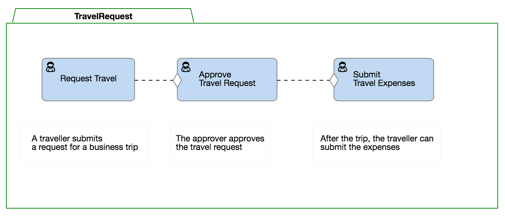

As a business grows, it is inevitable that it will need to formalize its procedures on how work should be performed. Without coordination, processing and approval of seemingly simple requests can potentially turn into long email trails, missed communications, and frustration between team members.

Qollabor is the software solution we are building to improve how this work is organized. It is a tool that allows you to organize your work by visualizing it. Procedures are standardized by creating visual models of how team members interact together on tasks and clearly defining the order in which tasks must be completed. This automates the process and keeps a process moving along smoothly to completion. Everyone in the team can clearly know what their roles in the process are and how the work is moving along.

So, what would this look like? Let’s look at a common procedure in many organizations: business travel. One of our team members needs to organize a trip to visit a client. Previously, most of the responsibility fell on the shoulders of the requesting team member. They would have to fill in a form, email it to their supervisor, and get the approved form back from the supervisor. After the trip, they would need to fill in another form detailing travel expenses, submit this form for approval, and finally submit their approved expenses to accounting for reimbursement. This example relies heavily on the requester to manage the entire process by keeping track of where they are in the process and moving it along manually.

Using Qollabor, we can break down this request into smaller processes: Requesting Travel, Approving Travel, and Submitting the Expenses. We can create a visual model of these processes as shown below.

Within each process, we can define rules and responsibilities that must be met at each step. This allows us to build standardized models to handle many different kinds of requests and optimize cooperation between team members.

For example, we can make sure there are no more incomplete request forms by requiring specific information before it ever is submitted. We can define an approver role so that once the travel request is created, the appropriate supervisor is notified of the request. After approval, the process automatically moves onto the final step and lets the requester know their request is approved. It assigns them a new task to submit their travel expenses after the trip.

The order of these tasks is important, and Qollabor manages the entire process. It delegates tasks to the correct team members since these roles can be clearly defined when designing the model. This removes the burden from the requester of figuring out who they should send a request to, remembering where they are in the process, and prevents them from sending it to the wrong team member.

As a software engineer at SpronQ, it’s quite exciting to be creating a tool that allows teams to work better together. I love building software that empowers a person to do their best work by reducing unnecessary burdens on them.
